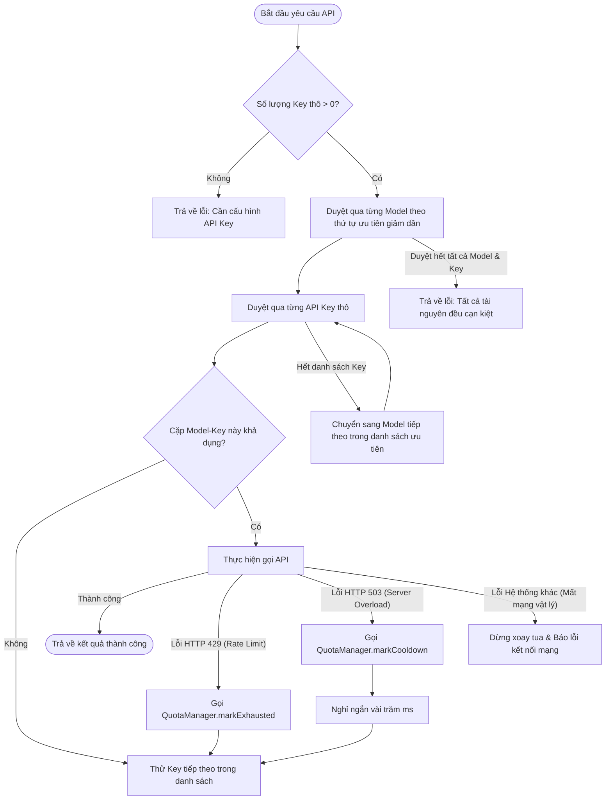

# Universal Multi-Model Multi-Key API Rotation & Quota Management Pattern

Tài liệu này đặc tả **Mẫu Thiết kế Kiến trúc Xoay tua API Đa mô hình & Đa khóa (Universal Multi-Model Multi-Key API Rotation & Quota Management Pattern)**. Mẫu thiết kế này độc lập với ngôn ngữ lập trình và có thể dễ dàng áp dụng cho các dự án phát triển bằng **Kotlin, Python, Go, Rust**, hoặc bất kỳ ngôn ngữ nào khác.

Mục tiêu chính của mẫu thiết kế này là nâng cao khả năng chịu lỗi (Resilience), phân bổ tải (Load Distribution), và tối ưu hóa trải nghiệm người dùng (UX) bằng cách tự động lựa chọn mô hình tốt nhất kết hợp với các khóa API khả dụng, đồng thời xử lý tinh tế các trạng thái lỗi từ nhà cung cấp dịch vụ (ví dụ: Google Gemini, OpenAI, v.v.).

---

## 1. Thành phần Kiến trúc (Architectural Components)

Hệ thống xoay tua được chia làm 3 tầng thành phần có vai trò rõ rệt:

```
┌─────────────────────────────────────────────────────────────────┐
│                       1. CLIENT / ORCHESTRATOR                  │
│  - Duyệt danh sách Model ưu tiên từ cao xuống thấp (Model-First) │
│  - Thử lần lượt các khóa API thô khả dụng (Key-Second)          │
└────────────────┬────────────────────────────────┬───────────────┘
                 │                                │
                 ▼ (Kiểm tra xem khóa thô có OK?)   ▼ (Kiểm tra cặp Model-Key bị chặn?)
┌─────────────────────────────────┐      ┌─────────────────────────────────┐
│     2. KEY STORE MANAGER        │      │   3. QUOTA & COOLDOWN MANAGER   │
│  - Lưu trữ API Keys toàn cục    │      │  - model::SHA-256(Key) 8B hash  │
│                                 │      │  - 429: Block lâu dài (Ghi đĩa)  │
│                                 │      │  - 503: Cooldown nhanh (Bội nhớ)│
└─────────────────────────────────┘      └─────────────────────────────────┘
```

### A. Key Store Manager (Bộ Quản lý Khóa Toàn cục)
* **Trách nhiệm**: Lưu trữ danh sách khóa API do người dùng hoặc cấu hình hệ thống cung cấp.
* **API tối thiểu**:
  * `getKeys() -> List[String]`: Lấy toàn bộ danh sách khóa cấu hình.

### B. Quota & Cooldown Manager (Bộ Quản lý Hạn ngạch & Trạng thái Chờ)
* **Trách nhiệm**: Quản lý giới hạn tải độc lập cho **từng cặp song hành `(Model, Key)`**. Sự độc lập này cực kỳ quan trọng vì khóa API có thể bị giới hạn hạn ngạch trên Model A nhưng vẫn hoàn toàn khả dụng trên Model B.
* **Cơ chế Hóa giải Định danh (Unique Hashing)**:
  Để ẩn khóa thô nhưng vẫn duy trì khả năng debug/giám sát trực quan, mã định danh duy nhất của cặp `(Model, Key)` được định dạng kết hợp giữa tên Model và phần băm ngắn 8-byte SHA-256 của API Key: `HashedId = ModelName + "::" + SHA256(ApiKey).take(8)`.
* **Phân loại Trạng thái Khóa**:
  1. **Exhausted State (Lỗi 429 - Quá tải hạn ngạch / Rate Limit)**:
     * **Thời hạn tạm khóa**: 24 giờ - 30 giờ.
     * **Phương thức lưu trữ**: **Bền vững (Persisted)** - Ghi xuống tệp tin, cơ sở dữ liệu cục bộ hoặc Redis để đảm bảo khi ứng dụng khởi động lại, trạng thái quá tải vẫn được duy trì.
  2. **Cooldown State (Lỗi 503 - Máy chủ bận / Service Unavailable)**:
     * **Thời hạn tạm khóa**: 2 phút - 5 phút.
     * **Phương thức lưu trữ**: **Tạm thời (In-memory)** - Lưu trong RAM của tiến trình ứng dụng. Trạng thái này sẽ biến mất khi ứng dụng khởi động lại vì 503 là lỗi tạm thời của hệ thống máy chủ bên thứ ba.

### C. Orchestrator / UseCase (Nhạc trưởng Điều hướng)
* **Trách nhiệm**: Thực hiện thuật toán lặp lồng ghép **Model-First, Key-Second** để gửi yêu cầu thành công với chất lượng phản hồi tốt nhất có thể.
* **Danh sách Mô hình Mặc định Hardcoded (Hardcoded Models Priority List)**:
  Thứ tự ưu tiên mặc định của các mô hình trong code khi xoay tua được đặc tả từ cao xuống thấp (Model-First) như sau:
  1. **Model 1**: `models/gemini-3.1-flash-lite` (Ưu tiên cao nhất)
  2. **Model 2**: `models/gemini-2.5-flash-lite` (Ưu tiên thứ hai)
  3. **Model 3**: `models/gemini-3-flash-preview` (Ưu tiên thứ ba)
  4. **Model 4**: `models/gemini-2.5-flash` (Ưu tiên thứ tư - Fallback cuối cùng)

---

## 2. Quy trình Xoay tua Đặc tả (Rotation Flowchart)



---

## 3. Bản thiết kế triển khai theo các Ngôn ngữ (Implementation Blueprints)

### ☕ Kotlin (Android / JVM)
* **Concurrence & Safety**: Sử dụng `kotlinx.coroutines.sync.Mutex` để đồng bộ truy cập thread-safe vào maps và SharedPreferences.
* **Storage**: `SharedPreferences` hoặc `EncryptedSharedPreferences` kết hợp `kotlinx.serialization` để lưu trữ dữ liệu JSON của các cặp bị lỗi 429.

```kotlin
class ModelQuotaManager(private val context: Context) {
    private val mutex = Mutex()
    private val exhaustedPairs = mutableMapOf<String, Long>() // Persisted
    private val cooldownPairs = mutableMapOf<String, Long>()  // In-memory

    private fun getHashId(model: String, apiKey: String): String {
        return try {
            val hash = java.security.MessageDigest.getInstance("SHA-256")
                .digest(apiKey.toByteArray())
                .take(8)
                .joinToString("") { "%02x".format(it) }
            "$model::$hash"
        } catch (e: Exception) {
            "$model::${apiKey.hashCode()}"
        }
    }

    suspend fun isAvailable(model: String, apiKey: String): Boolean = mutex.withLock {
        val id = getHashId(model, apiKey)
        val now = System.currentTimeMillis()
        if ((exhaustedPairs[id] ?: 0L) > now) return false
        if ((cooldownPairs[id] ?: 0L) > now) return false
        return true
    }
}
```

### 🐍 Python (Async / Backend APIs)
* **Concurrence & Safety**: Sử dụng thư viện `asyncio.Lock` để tránh xung đột ghi dữ liệu bất đồng bộ.
* **Storage**: Sử dụng file JSON nội bộ hoặc phân phối qua bộ nhớ đệm tập trung `Redis` cho môi trường multi-process.

```python
import hashlib
import time
import asyncio
import json

class ModelQuotaManager:
    def __init__(self, cache_file: str = "quota_cache.json"):
        self.lock = asyncio.Lock()
        self.cache_file = cache_file
        self.exhausted_pairs = self._load_persisted() # Persisted dict
        self.cooldown_pairs = {}                      # In-memory dict

    def _get_hash_id(self, model: str, api_key: str) -> str:
        key_hash = hashlib.sha256(api_key.encode('utf-8')).hexdigest()[:16]
        return f"{model}::{key_hash}"

    async def is_available(self, model: str, api_key: str) -> bool:
        async with self.lock:
            id = self._get_hash_id(model, api_key)
            now = time.time() * 1000
           
            # Kiểm tra 429 (Bền vững)
            if self.exhausted_pairs.get(id, 0) > now:
                return False
               
            # Kiểm tra 503 (Tạm thời)
            if self.cooldown_pairs.get(id, 0) > now:
                return False
               
            return True
```

### 🐹 Go (High-Concurreny Microservices)
* **Concurrence & Safety**: Sử dụng `sync.RWMutex` để tối ưu hóa hiệu năng đọc/ghi song song cực cao của Goroutines.
* **Storage**: Có thể sử dụng `sync.Map` kết hợp lưu trữ xuống tệp JSON hoặc cơ sở dữ liệu Key-Value nhúng như `bbolt` / `BadgerDB`.

```go
package rotation

import (
    "crypto/sha256"
    "encoding/hex"
    "sync"
    "time"
)

type ModelQuotaManager struct {
    sync.RWMutex
    exhaustedPairs map[string]int64 // Persisted
    cooldownPairs  map[string]int64 // In-memory
}

func (mq *ModelQuotaManager) GetHashID(model string, apiKey string) string {
    hash := sha256.Sum256([]byte(apiKey))
    return model + "::" + hex.EncodeToString(hash[:8])
}

func (mq *ModelQuotaManager) IsAvailable(model string, apiKey string) bool {
    id := mq.GetHashID(model, apiKey)
    now := time.Now().UnixNano() / int64(time.Millisecond)

    mq.RLock()
    defer mq.RUnlock()

    if exp, ok := mq.exhaustedPairs[id]; ok && exp > now {
        return false
    }
    if exp, ok := mq.cooldownPairs[id]; ok && exp > now {
        return false
    }
    return true
}
```

### 🦀 Rust (Systems-level Resilience & High Performance)
* **Concurrence & Safety**: Sử dụng `tokio::sync::RwLock` để đồng bộ luồng bất đồng bộ (async context) mà không làm nghẽn tiến trình của CPU.
* **Storage**: Sử dụng `serde` và `serde_json` để đọc ghi trạng thái bền vững.

```rust
use sha2::{Sha256, Digest};
use std::collections::HashMap;
use std::sync::Arc;
use tokio::sync::RwLock;
use std::time::{SystemTime, UNIX_EPOCH};

pub struct ModelQuotaManager {
    exhausted_pairs: Arc<RwLock<HashMap<String, u64>>>, // Persisted
    cooldown_pairs: Arc<RwLock<HashMap<String, u64>>>,  // In-memory
}

impl ModelQuotaManager {
    pub fn get_hash_id(model: &str, api_key: &str) -> String {
        let mut hasher = Sha256::new();
        hasher.update(api_key.as_bytes());
        let hash = hex::encode(&hasher.finalize()[..8]);
        format!("{}::{}", model, hash)
    }

    pub async fn is_available(&self, model: &str, api_key: &str) -> bool {
        let id = Self::get_hash_id(model, api_key);
        let now = SystemTime::now()
            .duration_since(UNIX_EPOCH)
            .unwrap()
            .as_millis() as u64;

        // Check active exhausted limits
        if let Some(&expiry) = self.exhausted_pairs.read().await.get(&id) {
            if expiry > now {
                return false;
            }
        }

        // Check active cooldown blocks
        if let Some(&expiry) = self.cooldown_pairs.read().await.get(&id) {
            if expiry > now {
                return false;
            }
        }

        true
    }
}
```

---

## 4. Hướng dẫn Tích hợp Mô hình mới & Điều chỉnh Tham số

Bất kỳ lập trình viên hay Agent AI nào khác khi muốn tùy biến hệ thống này chỉ cần thực hiện 3 hành động sau:

1. **Thêm cấu hình Model mới**: Thêm định danh chuỗi của mô hình mới vào mảng ưu tiên trong lớp Orchestrator (Kotlin `listOf()`, Python `[]`, Go `[]string`, Rust `vec![]`).
2. **Xếp hạng ưu tiên**: Đặt mô hình mạnh nhất ở chỉ mục `0` (vị trí đầu tiên) và mô hình yếu nhất/rẻ nhất ở cuối mảng để tối ưu cơ chế Fallback chất lượng.
3. **Điều chỉnh tham số Cooldown**:
   * Nếu nhà cung cấp dịch vụ cập nhật lại thời gian giới hạn tải (Rate Limit reset windows), chỉ cần thay đổi biến thời gian chờ:
     * `EXHAUSTED_DURATION_MS` (Mặc định: 30 giờ đối với API miễn phí của Gemini - tương đương khoảng thời gian hồi phục hạn ngạch ngày).
     * `COOLDOWN_DURATION_MS` (Mặc định: 5 phút đối với lỗi quá tải tức thời của cụm máy chủ).

---

## 5. Đặc tả Giao diện Quản lý Mô hình Động (Dynamic Model Management & UI Specification)

Nhằm nâng cao tính tùy biến và trải nghiệm người dùng cao cấp, hệ thống xoay tua hỗ trợ cơ chế quản lý mô hình động qua giao diện người dùng (UI). Các dự án triển khai mẫu thiết kế này cần tuân thủ các quy tắc thiết kế UI/UX sau:

### A. Yêu cầu giao diện (UI Form Requirements)
* **Form Thêm mới (Add Model Form)**: Cung cấp ô nhập liệu (Text Field) cho phép người dùng tự nhập chuỗi định danh của mô hình (ví dụ: `models/gemini-2.5-pro`, `models/gemini-1.5-ultra`,...).
* **Hỗ trợ CRUD (Thêm, Sửa, Xóa)**: 
  * Cho phép người dùng chỉnh sửa chuỗi định danh của các mô hình hiện tại để tránh việc nhập sai.
  * Có nút xóa (Delete Icon) bên cạnh mỗi mô hình để loại bỏ nó khỏi chu kỳ xoay tua.
  * Hỗ trợ lưu trữ bền vững (Persistent Storage - ví dụ: SharedPreferences/Room trong Android, LocalStorage trong Web, SQLite hoặc JSON Config trên Backend) để duy trì danh sách mô hình tùy chỉnh này cho các lần sử dụng tiếp theo.

### B. Cơ chế Hồi phục Danh sách mặc định (Fallback & Self-Healing Mechanism)
Để tránh ứng dụng bị crash hoặc không thể thực hiện request khi danh sách mô hình bị trống:
* **Tự động khôi phục (Reset to Defaults)**: Nếu danh sách mô hình trong bộ nhớ lưu trữ bền vững bị trống (do người dùng xóa hết hoặc khi cài đặt ứng dụng lần đầu), hệ thống **ngay lập tức** tự động khôi phục lại danh sách các mô hình mặc định đã được hardcode trong dự án (`MODELS`).
* **Hành vi an toàn (Safe Fallback)**: Logic kiểm tra danh sách rỗng phải được đặt ở mức độ lưu trữ dữ liệu (Data Repository/Preferences Level) hoặc trước khi Orchestrator duyệt danh sách, đảm bảo luồng quay vòng luôn có ít nhất một mô hình khả dụng để thực thi.


